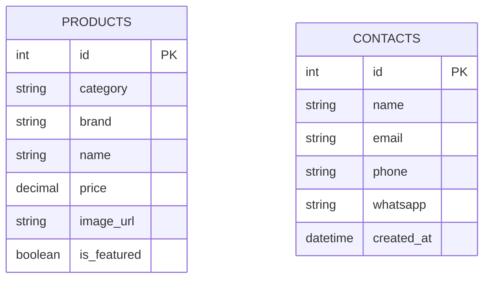

# Documentation et soutenance - Info-Sup Digital

## 1. Presentation generale

Info-Sup Digital est un site web realise en PHP natif pour presenter une agence digitale a Casablanca. Le site propose trois axes de service:

- creation de sites web;
- vente de materiel informatique et de securite;
- creation d'agents d'intelligence artificielle.

Le projet contient aussi un espace d'administration qui permet de consulter les messages recus et de gerer le catalogue de produits.

## 2. Pile technique

| Couche | Technologie | Role |
|---|---|---|
| Langage serveur | PHP natif moderne | Rendu HTML, sessions, validation, acces base de donnees |
| Base de donnees | MySQL via PDO | Stockage des produits et des contacts |
| Frontend | HTML, CSS, JavaScript vanilla | Interface, animations, panier, modal de contact |
| Serveur web | Apache + `.htaccess` | URLs propres, securite, redirections HTTPS |
| Hebergement cible | Hostinger / serveur PHP classique | Deploiement simple sans framework |

Le code utilise `declare(strict_types=1)`, PDO, des sessions securisees, des requetes preparees, des tokens CSRF et du JavaScript sans librairie externe.

## 3. Architecture generale du sous-site

```text
/
|-- index.php                  Page d'accueil
|-- web.php                    Page creation web
|-- materiel.php               Catalogue materiel connecte a MySQL
|-- ia.php                     Page agents IA
|-- contact.php                Controleur JSON du formulaire de contact
|-- .htaccess                  Redirections, URLs propres, securite Apache
|-- includes/
|   |-- config.php             Configuration, constantes, session, PDO
|   |-- functions.php          Helpers, securite, acces donnees
|   |-- header.php             En-tete commun, navigation, CSS
|   |-- footer.php             Footer, panier, modal contact, scripts
|-- admin/
|   |-- index.php              Connexion admin + dashboard
|   |-- products.php           Gestion des produits
|   |-- contacts.php           Gestion des messages
|-- assets/
|   |-- css/style.css          Style public
|   |-- css/admin.css          Style admin
|   |-- js/main.js             Interactions frontend
|   |-- images/                Logos, favicon, images produits
```

L'application est un monolithe PHP natif: les pages publiques, les controleurs et les vues sont dans le meme projet. Il n'y a pas de framework externe comme Laravel.

## 4. Architecture MVC appliquee au PHP natif

### 4.1 Idee generale

Le projet n'utilise pas un MVC strict avec des dossiers separes `models/`, `views/` et `controllers/`. Il applique plutot un **MVC leger en PHP natif**. Cela veut dire que les trois responsabilites MVC existent, mais elles sont reparties dans des fichiers PHP simples.

Le principe reste le meme:

```text
Utilisateur
-> URL, clic ou formulaire
-> Controleur PHP
-> Fonctions modele + base MySQL
-> Vue HTML ou reponse JSON
-> Navigateur
```

Dans un framework comme Laravel, un routeur central appelle une classe Controller, qui appelle une classe Model, puis retourne une View. Ici, le fonctionnement est plus direct: Apache et `.htaccess` choisissent le fichier PHP, puis ce fichier joue souvent le role de controleur et de vue en meme temps.

### 4.2 Correspondance MVC dans ce site

| Role MVC | Definition | Dans ce projet | Exemples |
|---|---|---|---|
| Model | Partie qui represente les donnees et l'acces a la base | Connexion PDO, fonctions SQL, tables MySQL | `getDB()`, `getProducts()`, `getContacts()`, `products`, `contacts` |
| View | Partie qui affiche le resultat a l'utilisateur | HTML/PHP, header, footer, cartes produits, formulaires | `index.php`, `web.php`, `materiel.php`, `ia.php`, `includes/header.php`, `includes/footer.php` |
| Controller | Partie qui recoit la requete, verifie les donnees, appelle le modele et choisit la reponse | Debut des pages PHP, fichiers POST, actions admin | `contact.php`, `materiel.php`, `admin/index.php`, `admin/products.php`, `admin/contacts.php` |

Le point important a expliquer pendant la soutenance: **ce n'est pas l'organisation des dossiers qui fait le MVC, c'est la separation des responsabilites**. Meme si `materiel.php` contient du controleur et de la vue, on peut identifier clairement ce que chaque partie fait.

### 4.3 Role du routage

Le routage est gere par Apache avec `.htaccess`.

```text
/web      -> web.php
/materiel -> materiel.php
/ia       -> ia.php
/contact  -> contact.php
```

La regle importante est:

```apache
RewriteRule ^(web|materiel|ia|contact)$ $1.php [L]
```

Cela permet d'avoir des URLs propres sans afficher `.php` dans l'adresse. Par exemple, l'utilisateur voit `/materiel`, mais le serveur execute `materiel.php`.

### 4.4 Detail du Model

La couche Model est composee de deux parties.

Premiere partie: `includes/config.php`

- definit les constantes du site: `APP_NAME`, `APP_URL`, `CONTACT_EMAIL`, `WHATSAPP_NUMBER`;
- definit les constantes de base de donnees: `DB_HOST`, `DB_NAME`, `DB_USER`, `DB_PASS`;
- demarre la session PHP;
- contient `getDB()`, qui cree et reutilise une connexion PDO.

Deuxieme partie: `includes/functions.php`

- contient les fonctions de securite: `sanitize()`, `csrf_token()`, `verify_csrf()`;
- contient les fonctions admin: `isAdmin()`, `requireAdmin()`, `verifyAdminLogin()`;
- contient les fonctions d'acces aux donnees: `getProducts()`, `getFeaturedProducts()`, `getContacts()`, `getProductCount()`;
- contient les fonctions de validation: `isValidEmail()`, `isValidPhone()`, `validateUploadedFile()`;
- contient `jsonResponse()` pour retourner une reponse JSON standard.

Exemple de logique Model:

```text
materiel.php demande les produits
-> getDB() donne l'objet PDO
-> getProducts($pdo, '') execute SELECT * FROM products
-> la fonction retourne un tableau PHP
-> la vue affiche chaque produit
```

Dans ce projet, il n'y a pas de classes comme `ProductModel` ou `ContactModel`. Les fonctions jouent ce role de maniere simple.

### 4.5 Detail des Views

Les vues sont les fichiers qui produisent le HTML final.

Les vues communes:

| Fichier | Role |
|---|---|
| `includes/header.php` | Debut HTML, balises `<head>`, menu, logo, navigation |
| `includes/footer.php` | Footer, panier, modal de contact, bouton WhatsApp, chargement de `main.js` |

Les vues de pages:

| Fichier | Role d'affichage |
|---|---|
| `index.php` | Accueil, hero, services, processus, statistiques |
| `web.php` | Offres de creation web, portfolio, tarifs |
| `materiel.php` | Catalogue produit dynamique |
| `ia.php` | Offres agents IA, avantages, cas d'usage |
| `admin/index.php` | Formulaire login ou dashboard admin |
| `admin/products.php` | Formulaire ajout produit + tableau produits |
| `admin/contacts.php` | Tableau des messages recus |

Les pages publiques utilisent presque toutes le meme squelette:

```php
$currentPage = 'materiel';
$pageTitle = 'Materiel Informatique - Info-Sup Digital';
require_once __DIR__ . '/includes/config.php';
require_once __DIR__ . '/includes/functions.php';
require_once __DIR__ . '/includes/header.php';

// contenu HTML de la page

require_once __DIR__ . '/includes/footer.php';
```

`$currentPage` sert a activer le bon lien du menu. `$pageTitle` sert a personnaliser le titre de la page dans l'onglet du navigateur.

### 4.6 Detail des Controllers

Le controleur est la partie qui prend une decision. Dans ce site, il peut etre:

- un fichier complet, comme `contact.php`;
- le debut d'une page, comme `materiel.php`;
- une action POST dans une page admin, comme `admin/products.php`.

Exemples:

| Controleur | Ce qu'il fait |
|---|---|
| `contact.php` | Refuse les requetes non POST, verifie CSRF, valide email/telephone, insere le contact, retourne JSON |
| debut de `materiel.php` | Charge PDO, recupere statistiques, categories et produits, prepare les variables pour la vue |
| `admin/index.php` | Gere login, logout, session admin, dashboard |
| `admin/products.php` | Gere ajout produit, upload image, suppression produit |
| `admin/contacts.php` | Gere suppression de message et affichage des contacts |

Un controleur typique suit cette logique:

```text
1. Inclure config.php et functions.php
2. Verifier la methode HTTP ou la session
3. Lire les donnees GET/POST
4. Nettoyer et valider les donnees
5. Appeler PDO ou une fonction modele
6. Retourner une vue HTML, une redirection ou du JSON
```

### 4.7 Flux MVC: page statique `/web`

La page `/web` est presque uniquement une View. Elle presente des informations statiques.

```text
Utilisateur ouvre /web
-> .htaccess execute web.php
-> web.php definit $currentPage et $pageTitle
-> web.php inclut config.php et functions.php
-> web.php inclut header.php
-> web.php affiche les offres et les tarifs
-> web.php inclut footer.php
-> main.js active les animations et le modal contact
```

MVC dans ce cas:

| Role | Fichier |
|---|---|
| Model | presque aucun, car les donnees sont dans des tableaux PHP locaux |
| Controller | debut de `web.php`, tres simple |
| View | majorite de `web.php`, `header.php`, `footer.php` |

### 4.8 Flux MVC: catalogue `/materiel`

La page `/materiel` est le meilleur exemple de MVC dynamique.

```text
Utilisateur ouvre /materiel
-> .htaccess execute materiel.php
-> materiel.php appelle getDB()
-> materiel.php appelle getProductCount(), getBrandCount(), getCategoryCount()
-> materiel.php execute une requete pour les categories
-> materiel.php appelle getProducts()
-> functions.php lit la table products avec PDO
-> materiel.php recoit les tableaux de donnees
-> materiel.php affiche les statistiques, categories et cartes produits
-> main.js filtre les produits cote navigateur
-> main.js gere le panier dans localStorage
```

MVC dans ce cas:

| Role | Fichier |
|---|---|
| Model | `getDB()`, `getProducts()`, `getProductCount()`, table `products` |
| Controller | bloc `try/catch` au debut de `materiel.php` |
| View | HTML de `materiel.php`, `header.php`, `footer.php` |
| Interaction client | `assets/js/main.js` |

Le filtrage par categorie n'interroge pas la base a chaque clic. PHP charge tous les produits au depart, puis JavaScript masque ou affiche les cartes selon leur attribut `data-category`.

### 4.9 Flux MVC: formulaire de contact AJAX

Le formulaire de contact est separe en trois parties:

- la vue du formulaire est dans `includes/footer.php`;
- le JavaScript d'envoi est dans `assets/js/main.js`;
- le controleur serveur est `contact.php`.

Flux complet:

```text
Utilisateur clique sur "Devis gratuit"
-> openContactModal() affiche le modal
-> l'utilisateur remplit le formulaire
-> main.js intercepte submit
-> main.js envoie FormData vers /contact.php en POST AJAX
-> contact.php verifie que la methode est POST
-> contact.php verifie le token CSRF
-> contact.php applique le rate limiting
-> contact.php nettoie les champs avec sanitize()
-> contact.php valide email et telephone
-> contact.php insere le message dans contacts
-> contact.php envoie une notification avec mail()
-> contact.php retourne JSON success/error
-> main.js lit le JSON
-> main.js affiche le message de succes et ouvre WhatsApp
```

MVC dans ce cas:

| Role | Fichier |
|---|---|
| Model | `getDB()`, table `contacts`, requete `INSERT INTO contacts` |
| Controller | `contact.php` |
| View | modal dans `footer.php` + message de succes dans le navigateur |
| Interaction client | `main.js` avec `XMLHttpRequest` |

Ce flux est important car il montre une page moderne sans rechargement complet: le navigateur reste sur la page, mais le serveur recoit quand meme les donnees.

### 4.10 Flux MVC: connexion admin

Le fichier `admin/index.php` a deux vues possibles:

- si l'admin n'est pas connecte: formulaire de connexion;
- si l'admin est connecte: dashboard.

Flux:

```text
Admin ouvre /admin/
-> admin/index.php inclut config.php et functions.php
-> si $_SESSION['is_admin'] est vide, affichage du formulaire login
-> admin poste username/password
-> admin/index.php verifie CSRF
-> admin/index.php verifie anti brute-force
-> verifyAdminLogin() compare l'utilisateur et le hash bcrypt
-> si succes: session_regenerate_id() + $_SESSION['is_admin'] = true
-> redirection vers /admin/
-> dashboard affiche contacts recents et statistiques
```

MVC dans ce cas:

| Role | Fichier |
|---|---|
| Model | `verifyAdminLogin()`, `getContactCount()`, `getProductCount()`, requetes SQL |
| Controller | `admin/index.php` |
| View | formulaire login et dashboard dans `admin/index.php` |

### 4.11 Flux MVC: ajout d'un produit admin

L'ajout d'un produit est gere par `admin/products.php`.

```text
Admin ouvre /admin/products.php
-> requireAdmin() verifie la session
-> la page affiche le formulaire d'ajout
-> admin envoie le formulaire en POST
-> admin/products.php verifie CSRF
-> admin/products.php nettoie les champs
-> admin/products.php verifie la categorie autorisee
-> si image uploadee: validateUploadedFile()
-> le fichier image est place dans assets/images/products/
-> INSERT INTO products avec requete preparee
-> la page recharge la liste des produits
```

MVC dans ce cas:

| Role | Fichier |
|---|---|
| Model | table `products`, PDO, `validateUploadedFile()` |
| Controller | blocs POST de `admin/products.php` |
| View | formulaire et tableau dans `admin/products.php` |

### 4.12 Difference entre MVC strict et MVC de ce projet

| MVC strict avec framework | MVC de ce projet |
|---|---|
| Routeur central | `.htaccess` + fichiers PHP directs |
| Classes Controller | fichiers PHP qui jouent le role de controleur |
| Classes Model | fonctions dans `includes/functions.php` + tables MySQL |
| Templates View separes | HTML directement dans les pages PHP + includes communs |
| ORM possible | PDO et requetes SQL preparees |

Cette approche est adaptee pour un projet PHP natif de taille moyenne. Elle est plus simple a comprendre et a deployer. Si le projet grandit beaucoup, on pourrait le faire evoluer vers une structure plus stricte:

```text
/controllers
/models
/views
/public/index.php
/config
```

Mais pour ce site, l'architecture actuelle reste claire: les includes centralisent le commun, les pages publiques affichent les vues, `contact.php` gere l'API contact et `admin/` gere les actions protegees.

## 5. Pages publiques et roles

| Page | URL propre | Fichier | Role |
|---|---|---|---|
| Accueil | `/` | `index.php` | Presente l'agence, les services, le processus, les statistiques, les temoignages et les appels a l'action |
| Creation web | `/web` | `web.php` | Presente les realisations web, les forfaits et les tarifs |
| Materiel | `/materiel` | `materiel.php` | Affiche les produits depuis MySQL, les categories, les statistiques et les boutons panier |
| Agents IA | `/ia` | `ia.php` | Presente les offres d'agents IA, les avantages et les cas d'usage |
| Contact API | `/contact.php` | `contact.php` | Recoit les demandes du modal, valide, sauvegarde en base et renvoie du JSON |

Les pages publiques suivent le meme cycle:

1. definition de `$currentPage` pour activer le menu;
2. definition de `$pageTitle`;
3. inclusion de `config.php` et `functions.php`;
4. inclusion de `header.php`;
5. affichage du contenu de la page;
6. inclusion de `footer.php`.

## 6. Espace administration

| Page | URL | Role |
|---|---|---|
| Connexion + dashboard | `/admin/` | Authentifie l'administrateur, affiche le nombre de contacts, produits et les derniers messages |
| Produits | `/admin/products.php` | Ajoute des produits, upload des images, liste le catalogue, supprime un produit |
| Contacts | `/admin/contacts.php` | Liste les messages recus, ouvre email/WhatsApp, supprime un contact |

L'acces admin est protege par:

- mot de passe hache avec `password_verify`;
- session PHP;
- verrouillage apres plusieurs tentatives;
- verification IP et User-Agent;
- tokens CSRF sur connexion, deconnexion et actions de suppression/ajout;
- headers de securite admin;
- `requireAdmin()` sur les pages protegees.

## 7. Base de donnees

La connexion est centralisee dans `includes/config.php` avec `getDB()`. PDO est configure avec:

- `PDO::ERRMODE_EXCEPTION`;
- `PDO::FETCH_ASSOC`;
- requetes preparees;
- encodage `utf8mb4`.

Les constantes actuelles utilisent les variables d'environnement si elles existent:

```php
DB_HOST
DB_NAME
DB_USER
DB_PASS
```

Pour un vrai deploiement, il faut remplacer `CHANGE_ME` ou definir `DB_PASS` cote serveur.

### Tables deduites du code

Table `products`:

| Colonne | Type conseille | Role |
|---|---|---|
| `id` | INT AUTO_INCREMENT PRIMARY KEY | Identifiant produit |
| `category` | VARCHAR(50) | Categorie: cameras, reseau, pc, etc. |
| `brand` | VARCHAR(100) | Marque du produit |
| `name` | VARCHAR(200) | Nom du produit |
| `tag` | VARCHAR(50) | Badge: Nouveau, Promo |
| `price` | DECIMAL(10,2) | Prix actuel |
| `old_price` | DECIMAL(10,2) NULL | Ancien prix |
| `description` | TEXT NULL | Description courte |
| `features` | TEXT NULL | Caracteristiques separees par `|` |
| `image_url` | VARCHAR(500) NULL | Image locale ou URL externe |
| `is_featured` | TINYINT(1) | Produit en vedette |

Table `contacts`:

| Colonne | Type conseille | Role |
|---|---|---|
| `id` | INT AUTO_INCREMENT PRIMARY KEY | Identifiant message |
| `name` | VARCHAR(200) | Nom complet |
| `email` | VARCHAR(255) | Email client |
| `phone` | VARCHAR(50) NULL | Telephone |
| `whatsapp` | VARCHAR(50) NULL | Numero WhatsApp |
| `message` | TEXT | Besoin du client |
| `created_at` | DATETIME | Date de reception |

Schema SQL minimal:

```sql
CREATE DATABASE IF NOT EXISTS `info-sup`
  DEFAULT CHARACTER SET utf8mb4
  DEFAULT COLLATE utf8mb4_unicode_ci;

USE `info-sup`;

CREATE TABLE products (
  id INT AUTO_INCREMENT PRIMARY KEY,
  category VARCHAR(50) NOT NULL,
  brand VARCHAR(100) DEFAULT '',
  name VARCHAR(200) NOT NULL,
  tag VARCHAR(50) DEFAULT '',
  price DECIMAL(10,2) NOT NULL,
  old_price DECIMAL(10,2) NULL,
  description TEXT NULL,
  features TEXT NULL,
  image_url VARCHAR(500) NULL,
  is_featured TINYINT(1) NOT NULL DEFAULT 0
) ENGINE=InnoDB DEFAULT CHARSET=utf8mb4;

CREATE TABLE contacts (
  id INT AUTO_INCREMENT PRIMARY KEY,
  name VARCHAR(200) NOT NULL,
  email VARCHAR(255) NOT NULL,
  phone VARCHAR(50) NULL,
  whatsapp VARCHAR(50) NULL,
  message TEXT NOT NULL,
  created_at DATETIME NOT NULL DEFAULT CURRENT_TIMESTAMP
) ENGINE=InnoDB DEFAULT CHARSET=utf8mb4;
```

Relation logique:



Il n'y a pas encore de relation entre `contacts` et `products`. Le panier est stocke cote navigateur dans `localStorage`, puis envoye par WhatsApp; il n'y a pas de table `orders`.

## 8. Actions du site

### Actions visiteur

| Action | Fichier principal | Description |
|---|---|---|
| Naviguer entre pages | `header.php`, `.htaccess` | Menu vers Accueil, Creation Web, Materiel, Agents IA |
| Ouvrir le modal de devis | `footer.php`, `main.js` | Boutons `openContactModal()` |
| Envoyer un contact | `main.js`, `contact.php` | AJAX POST, validation, insertion MySQL, email, redirection WhatsApp |
| Filtrer les produits | `materiel.php`, `main.js` | Boutons categorie, filtrage sans rechargement |
| Ajouter au panier | `materiel.php`, `main.js` | Donnees produit dans `data-*`, stockage local |
| Modifier quantite panier | `main.js` | `updateQty()` |
| Supprimer un produit du panier | `main.js` | `removeFromCart()` |
| Vider le panier | `main.js` | `clearCart()` |
| Commander via WhatsApp | `main.js` | Construction d'un message avec total estime |
| Contacter directement WhatsApp | `footer.php` | Lien flottant `wa.me` |

### Actions administrateur

| Action | Fichier principal | Description |
|---|---|---|
| Connexion | `admin/index.php` | Verification utilisateur, mot de passe hash, anti brute-force |
| Deconnexion | `admin/index.php` | POST + CSRF, destruction session |
| Voir dashboard | `admin/index.php` | Nombre de contacts, produits, derniers messages |
| Ajouter produit | `admin/products.php` | Validation, upload image optionnel, INSERT `products` |
| Supprimer produit | `admin/products.php` | POST + CSRF, DELETE `products` |
| Voir contacts | `admin/contacts.php` | SELECT `contacts`, liens mail et WhatsApp |
| Supprimer contact | `admin/contacts.php` | POST + CSRF, DELETE `contacts` |

## 9. Comment afficher les pages

En production avec Apache:

- `/` affiche `index.php`;
- `/web` est reecrit vers `web.php`;
- `/materiel` est reecrit vers `materiel.php`;
- `/ia` est reecrit vers `ia.php`;
- `/contact` est reecrit vers `contact.php`;
- `/admin/` affiche le dashboard ou la connexion.

Sans `.htaccess`, on peut ouvrir les fichiers directement:

- `/web.php`;
- `/materiel.php`;
- `/ia.php`;
- `/contact.php` uniquement en POST;
- `/admin/index.php`.

Pour que le catalogue fonctionne:

1. creer la base MySQL;
2. creer les tables `products` et `contacts`;
3. configurer `DB_HOST`, `DB_NAME`, `DB_USER`, `DB_PASS`;
4. donner les droits d'ecriture a `assets/images/products/` pour les uploads;
5. ouvrir `/admin/products.php` pour ajouter les produits.

## 10. Flux importants a presenter

### Flux 1: affichage du catalogue

```text
Utilisateur -> /materiel
Apache -> materiel.php
materiel.php -> getDB()
materiel.php -> getProductCount(), getBrandCount(), getCategoryCount()
materiel.php -> SELECT category + getProducts()
Vue HTML -> cartes produits
main.js -> filtrage categories + panier
```

### Flux 2: demande de devis

```text
Utilisateur -> bouton "Devis gratuit"
footer.php -> modal contact
main.js -> FormData + AJAX POST
contact.php -> CSRF + validation + rate limiting
contact.php -> INSERT contacts
contact.php -> mail()
main.js -> message succes + WhatsApp
```

### Flux 3: ajout produit admin

```text
Admin -> /admin/products.php
requireAdmin()
Formulaire POST + CSRF
Validation categorie/prix
Validation MIME si image uploadee
INSERT products
Retour liste des produits
```

## 11. Securite

Points forts:

- `sanitize()` applique `htmlspecialchars` pour reduire XSS;
- requetes preparees PDO pour INSERT/DELETE;
- CSRF sur formulaires sensibles;
- `password_verify()` pour le mot de passe admin;
- limitation des tentatives de connexion;
- verrouillage session apres inactivite;
- cookies `httponly`, `samesite`, `secure`;
- validation email/telephone;
- rate limiting du formulaire contact;
- validation extension + MIME pour les images;
- blocage de fichiers sensibles dans `.htaccess`;
- headers HTTP de securite.

Points a ameliorer pour une version future:

- ajouter une table `orders` si l'on veut sauvegarder les commandes panier;
- ajouter une page d'edition produit, pas seulement ajout/suppression;
- journaliser les erreurs serveur dans un fichier prive;
- sortir toutes les configurations sensibles dans des variables d'environnement;
- ajouter un fichier de migration SQL officiel;
- ajouter un test automatique simple pour chaque controleur critique.

## 12. Renommage Info-Sup

Le projet a ete adapte pour le nouveau nom public:

- `APP_NAME` devient `Info-Sup Digital`;
- `APP_URL` devient `https://info-sup.com`;
- `CONTACT_EMAIL` devient `contact@info-sup.com`;
- l'expediteur email devient `noreply@info-sup.com`;
- la redirection `.htaccess` pointe vers `www.info-sup.com`;
- les titres, textes admin, alt de logo et messages WhatsApp utilisent Info-Sup;
- les SVG de logo affichent `INFO-SUP`;
- le stockage panier utilise `infosup_cart`.

## 13. Plan de soutenance orale

### Introduction

"J'ai realise un site web dynamique en PHP natif pour Info-Sup Digital. Le site presente les services de l'agence, affiche un catalogue de materiel depuis une base MySQL et propose un espace admin securise pour gerer les produits et les contacts."

### Partie 1: choix technologiques

"J'ai choisi PHP natif pour comprendre les bases du backend sans framework. PDO permet de communiquer avec MySQL proprement, tandis que HTML/CSS/JavaScript assurent l'interface utilisateur, les animations, le panier et les interactions."

### Partie 2: architecture

"Le site est organise en deux parties: le sous-site public et le sous-site admin. Les includes centralisent les elements communs: configuration, fonctions, header et footer. Le fichier `.htaccess` permet d'avoir des URLs propres et ajoute des protections."

### Partie 3: MVC

"Meme sans framework, j'ai applique le principe MVC: les fonctions et la base representent le modele, les fichiers HTML/PHP representent les vues, et les fichiers comme `contact.php` ou `admin/products.php` jouent le role de controleurs."

### Partie 4: base de donnees

"La base contient principalement `products` et `contacts`. La page materiel lit les produits pour afficher le catalogue. Le formulaire de contact insere les demandes dans `contacts`, puis l'admin peut les consulter."

### Partie 5: securite

"J'ai ajoute plusieurs protections: sessions securisees, mot de passe hache, CSRF, validation des entrees, requetes preparees PDO, verification des uploads et protections Apache."

### Conclusion

"Ce projet montre comment construire un vrai site PHP natif complet: pages publiques, base de donnees, administration, securite, formulaire AJAX, panier local et integration WhatsApp."

## 14. Questions possibles et reponses

**Pourquoi PHP natif ?**  
Pour maitriser les bases du web backend: routes, sessions, formulaires, securite, PDO et rendu HTML.

**Ou est le MVC si les dossiers `Model`, `View`, `Controller` n'existent pas ?**  
Le MVC est applique par responsabilite. Le modele correspond a `config.php`, `functions.php` et aux tables MySQL. Les vues correspondent aux fichiers HTML/PHP comme `header.php`, `footer.php`, `materiel.php`. Les controleurs correspondent aux parties qui traitent les requetes, par exemple `contact.php` ou les blocs POST dans `admin/products.php`.

**Pourquoi `materiel.php` est a la fois controleur et vue ?**  
Parce que le projet est en PHP natif simple. Le debut du fichier charge les produits depuis MySQL: c'est le role controleur. La suite du fichier affiche les cartes produits en HTML: c'est le role vue. Dans un framework, ces deux parties seraient dans deux fichiers separes.

**Pourquoi PDO ?**  
PDO permet une connexion propre a MySQL, gere les exceptions et protege contre les injections SQL avec les requetes preparees.

**Comment fonctionne le panier ?**  
Le panier est cote navigateur. Les produits sont stockes dans `localStorage` sous la cle `infosup_cart`, puis le bouton WhatsApp genere un message de commande.

**Est-ce que le panier est en base ?**  
Non. Le panier n'est pas sauvegarde en base. Pour une future version e-commerce, il faudrait ajouter une table `orders`.

**Comment le formulaire contact est-il protege ?**  
Il utilise un token CSRF, une validation email/telephone, un rate limit en session, puis une requete preparee PDO.

**Comment l'admin est-il securise ?**  
Par un mot de passe hache, une session PHP, une limite de tentatives, une verification IP/User-Agent et des tokens CSRF.

**Quel est le role de `.htaccess` ?**  
Il force HTTPS, cree des URLs propres, bloque des fichiers sensibles, ajoute des headers de securite et des regles de cache.

**Quelle est la difference entre public et admin ?**  
Le public affiche les services et collecte les demandes. L'admin gere les donnees: produits et contacts.

**Comment ajouter une nouvelle page ?**  
Creer un fichier PHP, definir `$currentPage` et `$pageTitle`, inclure `config.php`, `functions.php`, `header.php`, ecrire le HTML, puis inclure `footer.php`. Ajouter ensuite une regle `.htaccess` si l'on veut une URL propre.

**Comment ajouter une nouvelle categorie produit ?**  
Ajouter la categorie dans `$categoryLabels` de `materiel.php` et dans `$validCategories` / `$categories` de `admin/products.php`.

## 15. Fichiers importants a montrer pendant la soutenance

| Fichier | A montrer pour expliquer |
|---|---|
| `includes/config.php` | Configuration, PDO, session |
| `includes/functions.php` | Securite, CSRF, fonctions d'acces aux donnees |
| `materiel.php` | Lecture des produits et affichage catalogue |
| `contact.php` | Controleur POST, validation, insertion en base |
| `admin/index.php` | Authentification admin et dashboard |
| `admin/products.php` | Ajout/suppression produit et upload |
| `admin/contacts.php` | Gestion des messages |
| `assets/js/main.js` | Modal, AJAX, panier, WhatsApp |
| `.htaccess` | URLs propres et securite serveur |

## 16. Resume final

Info-Sup Digital est une application PHP native complete. Elle combine un site vitrine, un catalogue dynamique, un formulaire de contact AJAX, un panier local avec commande WhatsApp et un espace admin protege. L'architecture est simple mais professionnelle: includes partages, couche donnees centralisee, controleurs PHP par page, vues HTML et interactions JavaScript.
